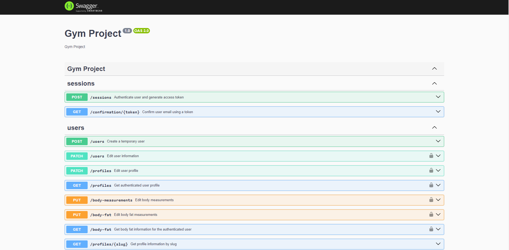

# Gym Project API

Esta é a API do **Gym Project**, uma plataforma voltada para a gestão de treinos, exercícios e acompanhamento de medidas corporais.

## Requisitos

Antes de iniciar, certifique-se de ter as seguintes ferramentas instaladas em seu ambiente:

- **Node.js** (versão 14.x ou superior)
- **npm** (gerenciador de pacotes do Node.js)
- **Postgres** (banco de dados, de acordo com a configuração do projeto)
- **Postman** ou similar (para testes da API)

## Instalação

Siga os passos abaixo para clonar e rodar o projeto localmente:

1. Clone o repositório para sua máquina local:
   ```bash
   git clone https://github.com/lfqcamargo/gym-project.git
   ```

2. Navegue até o diretório do projeto:
   ```bash
   cd gym-project
   ```

3. Instale as dependências do projeto:
   ```bash
   docker-compose up -d
   npm install
   ```

4. Crie um arquivo `.env` na raiz do projeto e adicione as variáveis de ambiente necessárias, como exemplo:

   ```bash
   PORT=3000
   DATABASE_URL=mongodb://localhost:27017/gymproject
   JWT_SECRET=sua_chave_secreta_aqui
   ```

   **Nota**: Se você estiver utilizando outro banco de dados como MySQL, adapte a URL do banco de acordo.

## Executando o Projeto

Depois de instalar todas as dependências e configurar o arquivo `.env`, siga os passos abaixo para rodar a API:

1. Inicialize o servidor em ambiente de desenvolvimento:
   ```bash
   npm run dev
   ```

2. Acesse a API em:
   ```
   http://localhost:3000
   ```

## Scripts Disponíveis

- `npm run dev`: Inicializa o servidor em modo de desenvolvimento, com suporte para reinicialização automática (usando Nodemon).
- `npm run start`: Inicia o servidor em modo de produção.
- `npm run test`: Inicia os testes unitários.
- `npm run test:watch`: Inicia os testes unitários em modo assistido.
- `npm run test:e2e`: Inicia os testes e2e.
- `npm run test:e2e:watch`: Inicia os testes e2e em modo assistido.

## Tecnologias Utilizadas

- **Node.js**: Plataforma para execução do JavaScript no backend.
- **Express**: Framework para a criação de servidores e APIs em Node.js.
- **MongoDB**: Banco de dados NoSQL (pode ser substituído por MySQL conforme necessário).
- **TypeScript**: Linguagem que adiciona tipagem estática ao JavaScript, proporcionando um desenvolvimento mais seguro e escalável.
- **JWT**: Para autenticação e autorização dos usuários.

## Testando a API

Você pode utilizar o **Postman**, **Insomnia** ou outra ferramenta de sua escolha para testar as rotas da API.

1. Após rodar o servidor, faça requisições para `http://localhost:3000/api/`.
2. Para testar funcionalidades de autenticação, como login ou criação de usuários, utilize tokens JWT gerados a partir das credenciais fornecidas pela API.

## Contribuição

Contribuições são sempre bem-vindas! Siga as etapas abaixo para contribuir:

1. Faça um fork do repositório.
2. Crie uma branch com a sua feature: `git checkout -b minha-nova-feature`.
3. Faça commit das suas alterações: `git commit -m 'Minha nova feature'`.
4. Envie para a branch principal: `git push origin minha-nova-feature`.
5. Abra um Pull Request.

## Licença

Este projeto está licenciado sob os termos da [MIT License](./LICENSE).

## Documentação da API

Aqui está uma captura de tela da documentação da API:

